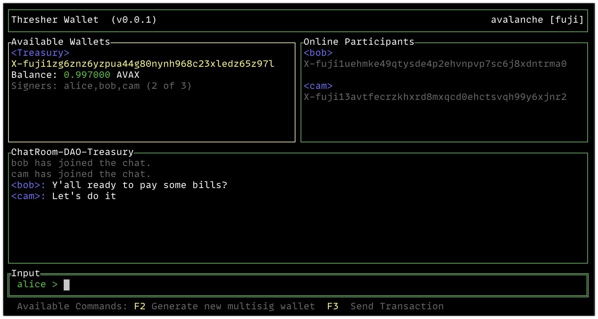

<div align="center">
 <pre>
 _______ _     _  ______ _______ _______ _     _ _______  ______
    |    |_____| |_____/ |______ |______ |_____| |______ |_____/
    |    |     | |    \_ |______ ______| |     | |______ |    \_
</pre>
</div>
<br>
<h2 align="center">🚧 EXPERIMENTAL! NOT FOR PRODUCTION USE! 🚧<h2>

## What?

`Thresher Wallet is a mpc wallet for Avalanche, with built-in chat, that uses Threshold Signatures to allow any number of signers to collaboratively manage an Avalanche X-chain wallet.`



[Screencast](http://www.tiogaventures.com.s3.amazonaws.com/screencast%202021-11-02%2010-51-10.gif)

The [Avalanche](https://www.avalabs.org/) blockchain (which you should check out immediately) is actually 3 chains, the P, X, and C chains. The P and X chains are UTXO chains built using Bitcoin-compatible Secp256k1 cryptography. Avalanche has built-in support for m-of-n multisig transactions, but that comes at a cost. Privacy is compromised, as anyone can see that a particular UTXO requires m-of-n sigs, and can see exactly which addresses signed a transaction, and for a large number of signers, the transaction size can get large. In the past few years a lot of progress has been made on Threshold Signature Schemes (TSS), which elegantly solve these problems.

A TSS UTXO looks exactly like any other single sig UTXO on the blockchain. No one can know it requires `m-of-n` signers, and when a transaction is signed by `m` signers, it is indistinguishable from a regular single sig transaction. This greatly improves privacy.

Another consideration is that signers must collaborate in real-time to create keys, and sign transactions. How to do this securely? Thresher uses `libp2p` to connect users into a secure, encrypted, peer-to-peer chat group, where they can safely communicate, create keys, and sign transactions.

## How?

To use Thresher you will need to build it yourself. (These commands will work on an Intel Mac, see the `Justfile` for compiling other versions.)

```bash
$ git clone git@github.com:johnthethird/thresher.git
$ cd thresher
$ just compile
$ bin/thresher version
```

The first thing we have to do is init our project, which creates a `json` file with all the configuration information. This file will contain your portion of all generated secrets, so it must be protected. It is currently not encrypted in any way.

```bash
$ bin/thresher init --help
Initialize a new config for a project.

blockchain: Only 'avalanche' is supported currently
network:    'mainnet' or 'fuji'
project:    The name of your project, e.g. 'DAOTreasury'
nick:       Your nickname in the chat, e.g. 'PrezCamacho'
address:    Your Avalanche X chain address, e.g. X-fuji1xv3653....

Usage:
  thresher init [blockchain network project nick address]
```

To make things easier, run this command which will generate configs for 3 users -- alice, bob, and cam.

```bash
$ just initusers

bin/thresher init avalanche fuji DAO-Treasury alice X-fuji1knjauvyjxf56tavysqnf9zxds084588nqja7j4
New project created with config file: DAO-Treasury-alice.json

bin/thresher init avalanche fuji DAO-Treasury bob X-fuji1uehmke49qtysde4p2ehvnpvp7sc6j8xdntrma0
New project created with config file: DAO-Treasury-bob.json

bin/thresher init avalanche fuji DAO-Treasury cam X-fuji13avtfecrzkhxrd8mxqcd0ehctsvqh99y6xjnr2
New project created with config file: DAO-Treasury-cam.json
```

Now open 3 separate terminals, and run these commands, one user in each terminal:

```bash
# Run in terminal window 1
$ just alice
# Run in terminal window 2
$ just bob
# Run in terminal window 3
$ just cam
```

This will start up a chat using the public `libp2p` bootstrap servers.

Now we can generate a new `m-of-n` multisig wallet. One of the users (any one) can type `F2` (or `/keygen` into the chat), which will kick off the key generation protocol.

Once you have a new wallet generated, it will be shown along with its Avalanche X address, and AVAX balance. You can use the Avalanche [Fuji faucet](https://faucet.avax-test.network/) to send some funds to your new wallet address.

Once the wallet has some funds, you can send them out by hitting `F3` (or typing `/sendtx` into the chat). This will kick off the signing protocol. All signers must be online to sign.

## Libp2p

By default, Thresher connects to the public `libp2p` bootstrap servers. This can be slow, and not as private as you may want. Thresher can also act as a private bootstrap server.

```bash
$ bin/thresher bootstrap

 _______ _     _  ______ _______ _______ _     _ _______  ______
    |    |_____| |_____/ |______ |______ |_____| |______ |_____/
    |    |     | |    \_ |______ ______| |     | |______ |    \_

Loading libp2p peer private key file /Users/alice/.config/thresher/peerprivkey.dat

[*] Libp2p Bootstrap Server Is Listening On:

  /ip4/127.0.0.1/tcp/4001/p2p/QmP2u7MBzKSt2YVJf7TyouBnh6Y1xTH1pPR1iqvVv3r8pq
  /ip4/200.121.111.63/tcp/4001/p2p/QmP2u7MBzKSt2YVJf7TyouBnh6Y1xTH1pPR1iqvVv3r8pq
```

Thresher will listen on all available interfaces, and will try to deduce your public IP. You should run this bootstrap server process on a machine that has a publicly available IP, which can accept incoming connections on port 4001.

To use this private bootstrap server, when you run Thresher you can specify it like so:

```bash
$ bin/thresher --config DAO-Treasury-alice.json --log alice.log wallet --bootstrap /ip4/200.121.111.63/tcp/4001/p2p/QmP2u7MBzKSt2YVJf7TyouBnh6Y1xTH1pPR1iqvVv3r8pq
```

**Note:** The `peerprivkey.dat` file the bootstrap server generates is only used to encrypt peer-to-peer communications, and if lost can be easily regenerated by just running the server again.

## Why?

I wanted a project where I could learn Go, libp2p, cryptography, and Avalanche. Thresher is the result.

- Written entirely in [Go](https://golang.org/), boring as hell to code in, but produces a single, fast, cross-platform binary
- [Avalanche](https://github.com/ava-labs/avalanchego) -- World's fastest blockchain
- [multi-party-sig](https://github.com/taurusgroup/multi-party-sig) -- Implementation of [Canetti et al](https://eprint.iacr.org/2021/060) Threshold Signature Scheme
- [libp2p](https://github.com/libp2p) -- Secure peer-to-peer communication
- [Tcell](https://github.com/gdamore/tcell) -- Terminal UI
- [Just](https://github.com/casey/just) -- It's Make, but for this century

Some interesting problems I came across while writing this app, where Google didn't help much:

- How to write a `libp2p` bootstrap server (see commands/bootstrap)
- Converting signature formats between various libs (avmwallet.go)

My original thought was to abstract out the blockchain code, and the libp2p code, such that Thresher could run against different blockchains and use different messaging channels, like KeyBase, Signal, Discord, or whatever. But I just needed to get it to work first, so things got a bit muddied.

## Ideas

This is basically a proof of concept, and there is a lot that could be done to make this a real app.

- Password-protect the config file, which contains secrets
- When using the public `libp2p` servers, figure out a way to lock the chat down to whitelisted users
- Use a shared secret to protect the private libp2p bootstrap server (libp2p.PrivateNetwork)
- Support Avalanche cross-chain (e.g. X -> P) transactions, NFTs, etc.
- Support other UTXO chains (Bitcoin, etc)
- Better [coin selection](https://github.com/bitcoin/bitcoin/blob/master/src/wallet/coinselection.cpp#L21) algorithms
- Support BIP32 HD keys
- Support other Avalanche assets besides AVAX
- Use something like [Chestnut](https://github.com/jrapoport/chestnut) for encrypted storage of all chats, transactions, etc.
- Fix up UI, allow for scrolling sections, etc
- Add HTML UI using [Wails](https://wails.app/)? See [example](https://github.com/matryer/xbar/blob/main/app/command_service.go)
- Other UIs? [Fyne](https://github.com/fyne-io/fyne), [Tauri](https://github.com/tauri-apps/tauri), [Flutter](https://github.com/go-flutter-desktop/go-flutter), [Gioui](https://gioui.org/)
- Autoclaim: After every transaction, have the signers immediately sign (but not broadcast)a new Tx with a future timestamp, that would allow any of the signers to claim all remaining funds in the wallet. In this way, if anything went wrong or some signers lost their keys and a threshold was not able to be reached, the funds would not be lost but could be reclaimed by any signer at some time in the future.

## Debugging Libp2p

If you need to see what is happening in the bowels of `libp2p`, you can set some ENV vars to take a peek:

```bash
# From https://github.com/ipfs/go-log
export GOLOG_FILE="libp2p.log"
export GOLOG_LOG_LEVEL="debug"
export GOLOG_LOG_FMT="nocolor"
bin/thresher wallet
```

## Thanks!

Thank you to all the brilliant programmers out there who make their efforts available so the rest of us can learn and hone our craft. In no particular order, these repos helped me on my journey:

- https://github.com/libp2p/demo-multi-lang
- https://github.com/driemworks/mercury-blockchain
- https://github.com/textileio/textile
- https://github.com/celestiaorg/go-libp2p-messenger
- https://github.com/manishmeganathan/peerchat
- https://github.com/planetdecred/godcr
- https://github.com/MichaelMure/git-bug
- https://github.com/skanehira/docui
